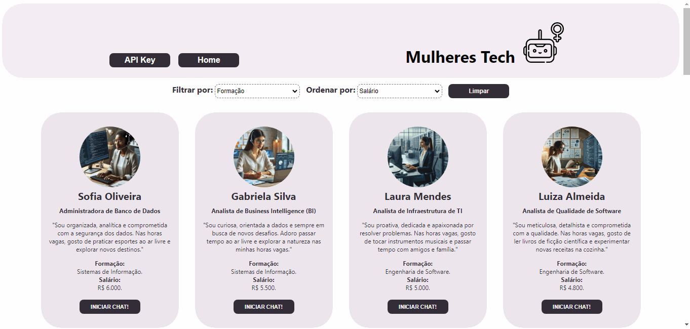

# Dataverse Chat

## Índice

* [1. Resumo do projeto](#1-resumo-do-projeto)
* [2. Ferramentas utilizadas](#2-ferramentas-utilizadas)
* [3. Funcionalidades](#3-funcionalidades)
* [4. Boilerplate](#4-Boilerplate)
* [5. Tarefas](#5-tarefas)
* [6. Considerações Finais](#6-considerações-finais)


***

## 1. Resumo do projeto

Neste projeto, foi transformada a aplicação desenvolvida no Dataverse
em uma Single Page Application (SPA),
mantendo as funcionalidades de visualização, filtragem por formação, ordenação por salário e
cálculo da estatística com o número de profissões compatíveis. Foi adicionada uma nova visualização (tela)
para consultar informações detalhadas de cada personagem/entidade com
a possibilidade de interagir com um profissional tech através
de um sistema de chat impulsionado pela [API da OpenAI](https://openai.com/product).

- Este projeto foi realizado em dupla por Camila Lara e Fabine Specian, com apoio da equipe e das colegas do Bootcamp de Desenvolvimento Front-end da **Laboratória**.
- O principal objetivo desse projeto é a aprendizagem e o desenvolvimento de habilidades técnicas e softskills.
- Não foi permitido o uso de frameworks de CSS (Bootstrap, Materialize, etc).
- O tempo de conclusão do projeto foi de 6 Sprints.
- O projeto foi publicado no [Netlify](https://dataversechat.netlify.app/
).

## 2. Ferramentas utilizadas

### Preparo do PC para trabalhar

+ Node.js
+ Git e GitBash
+ Playwright
+ Visual Studio Code

### Organização e planejamento

+ GitHub

+ Trello: [DataverseChat](https://trello.com/b/i1p8ocwU/dataverse-chat)

+ Notion: [DataverseChat](https://www.notion.so/DATAVERSE-CHAT-9d7915e8094944b983d5452b22d036be)

### Linguagens

+ HTML

+ CSS

+ Vanilla JavaScript

### Geração de dados

+ ChatGPT


### Prototipagem

+ Figma


## 3. Funcionalidades



Aqui estão definidas com mais detalhes as funcionalidades que foram implementadas:

* A aplicação é _responsiva_, ou seja, pode ser visualizada sem problemas
  em diferentes tamanhos de tela: celulares, tablets e desktops.

* A aplicação é uma SPA com várias visualizações:
  - Implementa um sistema de roteamento que permite a navegação dentro
    da aplicação.
  - Cada visualização da aplicação é carregada dinamicamente por meio
    do JavaScript.
  - Garante que a URL seja atualizada de acordo com a visualização carregada, assim como o `title` do documento (a aba do navegador).
  - A aplicação é capaz de carregar a visualização correspondente
    à URL atual ao iniciar a aplicação.

* A aplicação mantém as funcionalidades do Dataverse: visualizar,
  filtrar, ordenar e calcular estatísticas dos dados.

* Ao clicar em um card de personagem, a aplicação redireciona
  para uma visualização **com sua própria URL** e mostra informações
  detalhadas sobre aquele personagem em particular.

* A aplicação permite ao usuário configurar a API Key para
  interagir com a API da Open AI.

* Utilizando a API da Open AI, a aplicação permite que o usuário interaja
  com um personagem através de um chat.
  Por exemplo um usuário pode estabelecer uma conversa interativa através do sistema de chat, obtendo informações sobre suas realizações, desafios e contribuições dentro da sua carreira. A inteligência artificial da OpenAI permite que as respostas sejam informativas e personalizadas de acordo com as perguntas dos usuários.

* A aplicação informa à usuária sobre os erros que possam surgir ao  interagir com a API, bem como a não existência da página.

## 4. Boilerplate

A lógica deste projeto foi implementada em javascript. Não foi permitido o uso de bibliotecas e frameworks, apenas JavaScript puro, também conhecido como Vanilla Javascript.
Para começar este projeto, foi feito -fork_ e clone de um repositório da **Laboratória**, a partir do qual foi fornecida a estrutura básica com arquivos e configuração inicial de dependêncuas e testes, o _boilerplate_.
O _boilerplate_ continha a seguinte estrutura:

```text
.
├── src
|  ├── components 
|  ├── data
|  |  └── dataset.js
|  ├── lib
|  |  └── dataFunctions.js
|  ├── views
|  ├── index.html
|  ├── index.js
|  ├── router.js
|  └── style.css
├── test
|  └── dataFunctions.spec.js
|  └── example.spec.js
├── README.md
└── package.json

```


### 5. Tarefas


### Histórias da usuária

Após definir o produto, ao escrever as histórias de usuário a dividimos em 7 tarefas que foram nomeadas como T00 e o número definido.

História da usuária se estrutura com elementos Eu | Quero | Para.

**EU** como estudante do bootcamp da área da tecnologia da Laboratoria:


#### **`T001`**
**Quero** carregar uma página com informações: **Imagem (gerada por IA), Nome da Pessoa, Nome da Profissão, Minha Formação, Breve Descrição e Salário** em formato de cards sobre cada uma das personas.

**Para** ter um contexto geral das personas e suas profissões para assim escolher com qual persona deseja iniciar uma conversa (chat) e se informar.

#### **`T002`**
**Quero** filtrar as profissões por **Minha Formação** e ver ***estatísticas*** sobre a quantidade de profissões/carreiras para quais uma graduação pode ser compatível.E também ordenar as personas por seu **Salário** apresentando a opção de organizar por forma *Crescente* (do mais baixo ao mais alto) e *Decrescente* (do mais alto ao mais baixo).

**Para** saber qual formação/curso de graduação mais popular entre as profissionais da tecnologia. E quais são os melhores salário.

#### **`T003`**
**Quero** poder clicar numa profissional (card). 

**Para** ter as informações completas sobre ela.


#### **`T004`**
**Quero** poder iniciar uma conversa individual com essa profissional. 

**Para** fazer perguntas sobre a sua profissão e aprofundar meus conhecimentos sobre a carreira.


#### **`T005`**
**Quero** saber quando um ou vários personagens/entidades estiverem digitando uma resposta à mensagem enviada.

**Para** eu saber que estou tendo um retorno/resposta da persona com a qual iniciei a conversa.


#### **`T006`**
**Quero** que a aplicação me informe sobre os erros que possam surgir ao interagir com a API, como ao atingir a cota de tokens por minuto ou qualquer outro erro relacionado à API. 

**Para** eu estar informada sobre os erros e procedimentos necessários para sua resolução.


#### **`T007`**
**Quero** a qualquer momento poder retornar à página inicial com todos os cards (personas). 

**Para** que minha navegação durante o uso da aplicação seja simples e ágil.


#### Protótipo de alta fidelidade

Modelo para desktop:

- Home Page


- Chat Individual


- Error Page


Modelo para mobile:

- Home Page


- Chat Individual


- Error Page


## 6. Considerações finais

A condução do projeto proporcionou uma rica oportunidade para desenvolver uma ampla gama de habilidades e competências essenciais. Foi uma jornada de aprimoramento que expandiu nosso domínio em linguagens, ferramentas e tecnologias, destacando-se a integração e interação bem-sucedida da aplicação com a OpenAI. Essa colaboração acrescentou uma dimensão de inteligência e adaptabilidade ao nosso produto final.

Além disso, aspectos fundamentais como organização, planejamento estratégico e eficiente gestão de tempo foram refinados ao longo do processo. O trabalho em equipe eficaz e uma comunicação clara foram pilares essenciais para alcançar nossos objetivos. A necessidade constante de aprender e se adaptar impulsionou uma cultura de autoaprendizagem, garantindo que permanecêssemos atualizados e ágeis diante das demandas em constante evolução.

A superação dos desafios complexos inerentes ao projeto não só trouxe uma sensação gratificante de realização pessoal, mas também fortaleceu nossa confiança coletiva em enfrentar tarefas interdisciplinares de maneira proativa e eficaz. Este projeto não apenas representou uma conquista técnica, mas também uma valiosa oportunidade de desenvolvimento individual e em equipe.


## Desenvolvedoras


<table>
  <tr>
    <td align="center"><a href="https://github.com/camilasukhada"><br /><sub><b>Camila Sukhada</b></sub></a><br /></td>
    <td align="center"><a href="https://github.com/FabineSpecian"><br /><sub><b>Fabine Specian</b></sub></a><br /></td>
  </tr>
</table>

<table>
 <tr>
  <td> 
  
 [](https://www.linkedin.com/in/camilasukhada/) 
 
 </td>
  <td> 
 
 [](https://www.linkedin.com/in/fabine-specian-406316239/) 
 
  </td>
 </tr> 
</table>

<table>
 <tr>
  <td> 

[](mailto:camilasukhada@gmail.com)

  </td>
  
  <td> 

[](mailto:fabine.specian@gmail.com)

  </td>
 </tr> 
</table>


